# MVP Engenharia de Dados - Lakehouse de Desempenho do Brasileirão 2025 no Databricks

**Pós-graduação em Ciência de Dados e Analytics (PUC-Rio)** | Sprint: Engenharia de Dados<br>
**Aluno:** Yuri Ismério Ribeiro | **Matrícula:** 4052026001018<br>
**Plataforma:** Databricks Free Edition (Unity Catalog, Delta Lake e compute serverless)

Pipeline de dados completo, em arquitetura medalhão (Bronze, Silver e Gold), construído em cima dos dados
agregados da StatsBomb para as 380 partidas do Campeonato Brasileiro Série A 2025. A ideia é entregar para as
áreas de análise de desempenho e scouting de uma SAF uma base única, confiável, documentada e consultável em
SQL, que responda às perguntas do dia a dia e que já sirva o modelo de similaridade de jogadores que construí
no MVP anterior (Machine Learning & Analytics).

---

## Sumário

1. [Contexto e Perguntas de Negócio (Etapas 2 e 4.1)](#1-contexto-e-perguntas-de-negócio-etapas-2-e-41)
2. [Carga dos Dados (Etapa 4.2)](#2-carga-dos-dados-etapa-42)
3. [Modelagem e Catálogo de Dados (Etapa 4.3)](#3-modelagem-e-catálogo-de-dados-etapa-43)
4. [Pipeline de Dados (Etapa 4.4)](#4-pipeline-de-dados-etapa-44)
5. [Qualidade de Dados (Etapa 4.5)](#5-qualidade-de-dados-etapa-45)
6. [Análise de Dados (Etapa 4.5)](#6-análise-de-dados-etapa-45)
7. [Autoavaliação](#7-autoavaliação)
8. [Como Reproduzir](#8-como-reproduzir)

---

## 1. Contexto e Perguntas de Negócio (Etapas 2 e 4.1)

### 1.1 Contexto e Problema

Trabalho como engenheiro de dados no Botafogo e acompanho de perto como os dados de provedores externos, como a
StatsBomb, chegam e circulam entre as áreas do futebol. Análise de desempenho, scouting e diretoria usam essas
informações para comparar o time com a liga, avaliar atletas e montar short-lists de contratação.

O problema é que o dado não chega pronto para uso. O export da StatsBomb vem com 167 colunas, nomes técnicos em
inglês, nulos que significam coisas diferentes dependendo da métrica, nomes de clubes fora do padrão e sem placar
ou classificação. Hoje cada analista trata esse arquivo por conta própria, em planilha ou notebook local.

Essa forma de trabalhar gera dois problemas centrais:

- **Números divergentes entre áreas**, porque cada um aplica a sua própria regra de limpeza;
- **Retrabalho a cada nova análise**, já que o tratamento não fica registrado em lugar nenhum.

> **Objetivo do MVP:** construir na nuvem uma base única, tratada e documentada, que responda às perguntas
> recorrentes de desempenho e scouting e entregue pronto o insumo do modelo de similaridade de jogadores.

### 1.2 Perguntas de Negócio

As perguntas abaixo foram definidas pensando em quem consome esse tipo de dado no clube:

| # | Pergunta | Área demandante |
|---|---|---|
| **P1** | Como o Botafogo se compara com a média da liga e com o melhor clube em volume ofensivo (xG, finalizações) e defensivo (xG cedido, pressões, recuperações) por jogo? | Análise de desempenho |
| **P2** | O saldo de xG explica os pontos conquistados? Quais clubes terminaram acima ou abaixo do que o xG indicava? | Diretoria / Desempenho |
| **P3** | Quais jogadores de linha (mínimo de 900 minutos) lideram finalização (npxG/90) e criação (xA/90, passes decisivos/90), e em que percentil da liga estão os jogadores do Botafogo? | Scouting |
| **P4** | Quais jogadores converteram muito acima ou abaixo do esperado (gols sem pênalti menos xG)? | Scouting |
| **P5** | Como os clubes distribuem os minutos no elenco (núcleo fixo ou rotação)? | Diretoria / Fisiologia |
| **P6** | Dado um jogador de referência (Alexander Barboza), quais atletas da liga têm o perfil estatístico mais parecido? A camada Gold consegue servir esse modelo direto em SQL? | Scouting / Ciência de Dados |

### 1.3 Fonte de Dados

| Aspecto | Detalhes |
|---|---|
| Fonte | StatsBomb IQ, export de estatísticas agregadas por jogador por partida |
| Cobertura | Brasileirão Série A 2025 completo: 380 partidas, 20 clubes, 737 jogadores, 11.998 linhas x 167 colunas |
| Arquivo 1 | `estatisticas_jogadores_partida_brasileirao2025.csv` (9,3 MB). Identificadores (`account_id`, `match_id`, `team_id`, `team_name`, `player_id`, `player_name`) e 161 métricas `player_match_*`: volume (passes, finalizações, desarmes), valor (xG, xA, xGChain, OBV), métricas StatsBomb 360 e métricas de goleiro |
| Arquivo 2 | `dicionario_dados.csv` (167 linhas). Dicionário que produzi no MVP anterior, com a categoria de cada variável (Identificação, Universal, Condicional, Específica de posição) e a regra de tratamento de missing |
| Limitações | A fonte não traz data, rodada, mando de campo, placar nem posição do jogador. As métricas 360 dependem da cobertura de câmera da partida |
| Referência externa | Classificação final oficial da CBF (compilada na [Wikipédia](https://en.wikipedia.org/wiki/2025_Campeonato_Brasileiro_S%C3%A9rie_A)), usada só para reconciliação (ver seção 5) |

### 1.4 Licença e Uso dos Dados

Os dados StatsBomb foram obtidos por licença corporativa de acesso à plataforma, para uso interno e acadêmico.
Não são dados abertos e não podem ser redistribuídos. Por isso:

- os CSVs não estão neste repositório (o `.gitignore` bloqueia `*.csv`), e o enunciado dispensa a publicação dos dados;
- são dados de desempenho esportivo, publicamente observável. Não há dado pessoal sensível (CPF, salário, dado médico), então não foi preciso anonimizar;
- a classificação oficial é informação factual e pública (CBF).

---

## 2. Carga dos Dados (Etapa 4.2)

O caminho do dado até a Bronze é simples: upload do CSV em um volume do Unity Catalog e leitura com Spark para
uma tabela Delta.

```
CSV (StatsBomb) ──upload──► Volume UC /Volumes/mvp_brasileirao/bronze/landing/statsbomb/brasileirao_2025/
                                   │  spark.read.csv (tudo STRING) + _metadata
                                   ▼
                     bronze.statsbomb_jogador_partida_raw  (Delta)
```

| Etapa | O que é feito |
|---|---|
| 1. Estrutura | `notebooks/01_setup_ambiente.py` cria o catálogo `mvp_brasileirao`, os schemas `bronze`, `silver`, `gold` e `governanca`, e o volume gerenciado `bronze.landing` |
| 2. Upload | Os dois CSVs são enviados pela UI (*Catalog > bronze > Volumes > landing > Upload to this volume*). A última célula do notebook 01 confere se os arquivos chegaram |
| 3. Ingestão Bronze | `notebooks/02_bronze_ingestao.py` lê os arquivos e grava as tabelas Delta da Bronze |

Decisões da ingestão:

- **Leitura com `inferSchema=false`:** todas as colunas entram como STRING, para preservar exatamente o que veio da fonte. Tipagem é responsabilidade da Silver;
- **`mode=PERMISSIVE`:** nenhuma linha é descartada na leitura;
- **Metadados de controle:** `_arquivo_origem` e `_data_modificacao_arquivo` (coluna oculta `_metadata`), `_data_ingestao`, `_id_carga` e `_fonte`;
- **Carga completa idempotente (`overwrite`):** a temporada 2025 é um conjunto fechado, então rodar de novo sempre leva ao mesmo resultado;
- **Dicionário de dados:** a única alteração é renomear os cabeçalhos para snake_case, porque o Delta não aceita espaço ou parênteses em nome de coluna.

> **Princípio da Bronze:** dado exatamente como chegou da fonte. Nunca alterar o conteúdo.

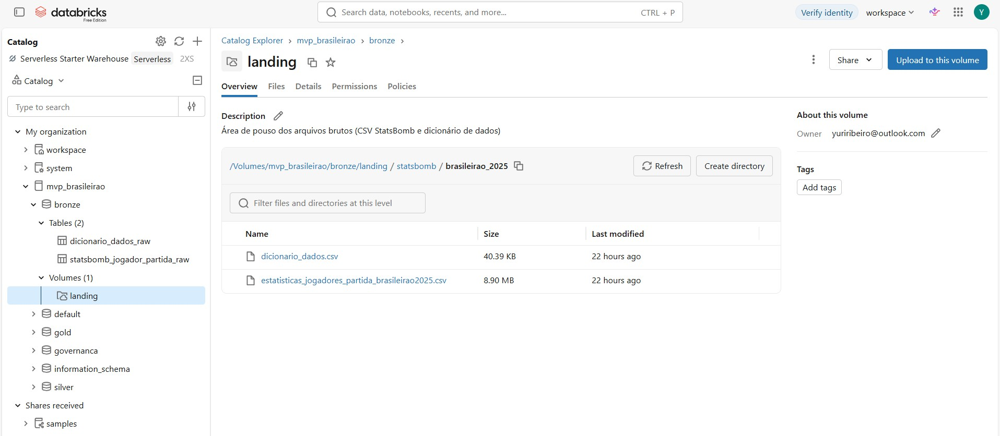
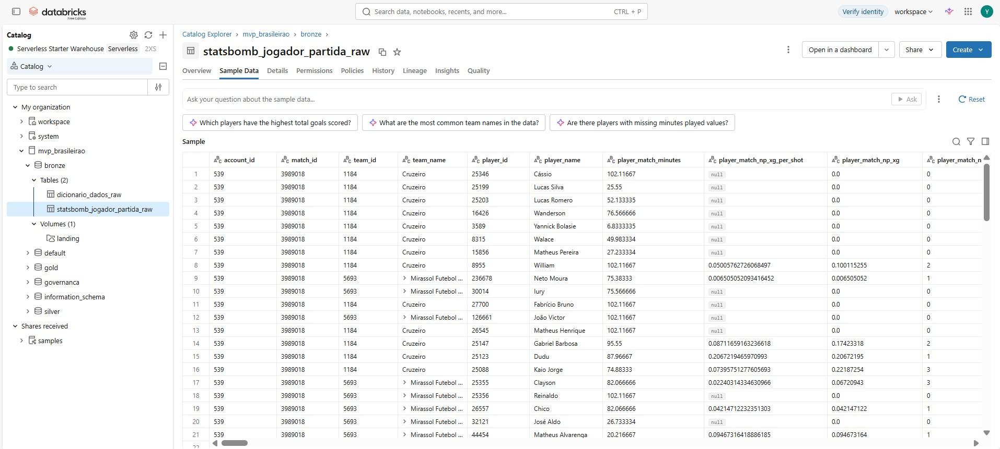

---

## 3. Modelagem e Catálogo de Dados (Etapa 4.3)

### 3.1 Organização no Unity Catalog

Cada camada do medalhão virou um schema, com um schema extra de governança para qualidade e catálogo:

| Schema | Tabelas | Papel |
|---|---|---|
| `bronze` | `statsbomb_jogador_partida_raw`, `dicionario_dados_raw` + volume `landing` | Dado como chegou |
| `silver` | `jogador_partida`, `jogador_partida_quarentena`, `dicionario_dados`, `time_de_para`, `classificacao_oficial_referencia` | Dado limpo, tipado e padronizado |
| `gold` | `dim_time`, `dim_jogador`, `dim_partida`, `fato_jogador_partida`, `fato_time_partida`, `mart_classificacao`, `mart_jogador_temporada`, `feature_similaridade_jogador` | Esquema estrela e marts |
| `governanca` | `dq_resultados`, `catalogo_dados` | Qualidade e catálogo consultáveis em SQL |

### 3.2 Esquema Estrela (Gold)

Optei por um esquema estrela com dois fatos em grãos diferentes (jogador x partida e time x partida),
compartilhando as mesmas dimensões. Em cima deles ficam os marts agregados, que são o que o analista consome
direto em SQL ou em dashboard.

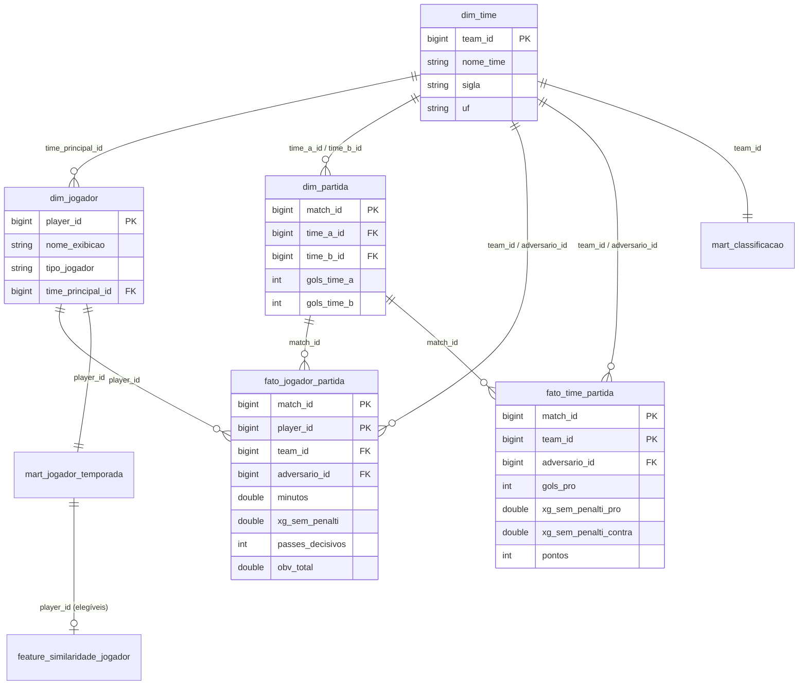

| Tabela | Grão | Linhas | Observações |
|---|---|---:|---|
| `dim_time` | clube | 20 | Nome padronizado, sigla e UF (de-para manual versionado em código) |
| `dim_jogador` | jogador | 737 | Clube principal = clube com mais minutos (25 atletas jogaram por 2 clubes). `nome_exibicao` resolve 40 nomes homônimos |
| `dim_partida` | partida | 380 | Placar derivado. Sem mando, porque a fonte não informa, por isso `time_a` / `time_b` |
| `fato_jogador_partida` | jogador x partida | 11.998 | 49 métricas renomeadas para português |
| `fato_time_partida` | time x partida | 760 | Pró e contra via self-join com o adversário, resultado e pontos |
| `mart_classificacao` | clube | 20 | Classificação derivada + oficial, xG pró e contra, indicadores por jogo |
| `mart_jogador_temporada` | jogador | 737 | Totais, 24 métricas per-90 e flag `elegivel_analise` |
| `feature_similaridade_jogador` | jogador elegível | 353 | 28 features per-90 em z-score + `vetor_features ARRAY<DOUBLE>` |

Decisões de modelagem:

- **Sem `dim_data`:** a fonte não traz data nem rodada. Ficou registrado como limitação e como trabalho futuro;
- **Métricas StatsBomb 360 fora da Gold:** as ~60 métricas 360 ficam na Silver, mas não sobem para a Gold. A cobertura é parcial e nenhuma pergunta depende delas;
- **Chaves declaradas no Unity Catalog:** 7 PKs e 12 FKs (constraints informativas). Com isso o Catalog Explorer desenha o diagrama ER sozinho;
- **CHECK constraints na Gold:** `minutos` entre 0 e 130, `passes_certos <= passes`, `pontos IN (0,1,3)`. Qualquer carga futura que quebre essas regras é bloqueada na gravação.

### 3.3 Catálogo de Dados

O catálogo existe em três formatos, todos gerados pelo notebook `06_catalogo_dados.py` a partir de uma única
definição em código. Assim não tem como um ficar desatualizado em relação ao outro.

| Formato | Onde fica | O que contém |
|---|---|---|
| Comentários no Unity Catalog | Catalog Explorer | Cada tabela e cada coluna (392 colunas em Silver e Gold) com `descrição \| domínio esperado \| linhagem` |
| Tabela `governanca.catalogo_dados` | SQL | Tipo, descrição, domínio esperado, domínio observado (mín/máx ou categorias, medido nos dados), % de nulos e linhagem |
| [`docs/catalogo_dados.md`](docs/catalogo_dados.md) | Repositório | Transcrição completa da tabela acima |

Na Silver, a descrição das 167 colunas StatsBomb vem do próprio dicionário de dados (`silver.dicionario_dados`).
O mesmo dicionário também define a tipagem e o tratamento de missing, então um único artefato governa a
documentação e a transformação.

Trecho do catálogo (`gold.mart_classificacao`):

| Coluna | Tipo | Descrição | Domínio esperado | Domínio observado | Linhagem |
|---|---|---|---|---|---|
| `pontos` | bigint | Pontos | 0 a 114 | [16 ; 79] | SUM(fato_time_partida.pontos) |
| `saldo_xg` | double | Saldo de xG sem pênalti | real | [-21,14 ; 24,88] | pro - contra |
| `pontos_oficiais` | int | Pontos na classificação oficial CBF | 0 a 114 | [17 ; 79] | silver.classificacao_oficial_referencia |
| `gols_contra_a_favor_nao_creditados` | int | Gols contra do adversário a favor do clube | inteiro >= 0 | [0 ; 3] | gols_pro_oficial - gols_pro |

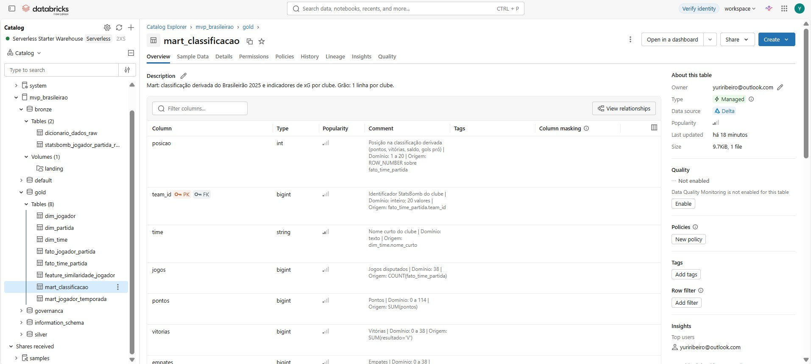
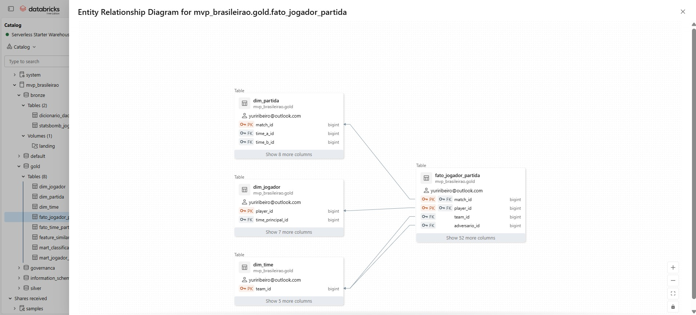

---

## 4. Pipeline de Dados (Etapa 4.4)

### 4.1 Organização

Separei o pipeline em um notebook por etapa. Fica mais fácil de manter, de rodar só um pedaço quando precisa
e de tirar evidência de cada camada. Todos incluem o `00_config` via `%run`, e um orquestrador executa a
sequência completa:

| Notebook | Etapa | Entrada > Saída |
|---|---|---|
| [`00_config`](notebooks/00_config.py) | Parâmetros, nomes de tabelas e funções de escrita | - |
| [`01_setup_ambiente`](notebooks/01_setup_ambiente.py) | Catálogo, schemas e volume | - > UC |
| [`02_bronze_ingestao`](notebooks/02_bronze_ingestao.py) | Extract | CSV no volume > `bronze.*` |
| [`03_silver_transformacao`](notebooks/03_silver_transformacao.py) | Transform (limpeza) | `bronze.*` > `silver.*` |
| [`04_gold_modelagem`](notebooks/04_gold_modelagem.py) | Transform (modelagem) + Load | `silver.*` > `gold.*` |
| [`05_qualidade_dados`](notebooks/05_qualidade_dados.py) | Checagens de qualidade | todas > `governanca.dq_resultados` |
| [`06_catalogo_dados`](notebooks/06_catalogo_dados.py) | Catálogo, PK/FK e CHECK | todas > comentários UC + `governanca.catalogo_dados` |
| [`07_analise_perguntas`](notebooks/07_analise_perguntas.py) | Respostas P1 a P6 em SQL | `gold.*` |
| [`99_pipeline_orquestrador`](notebooks/99_pipeline_orquestrador.py) | Executa 01 a 07 na mesma sessão (`%run`) | - |
| [`jobs/job_pipeline_mvp.yml`](jobs/job_pipeline_mvp.yml) | O mesmo fluxo como Lakeflow Job, com dependência entre tarefas | - |

Todas as tabelas são Delta gerenciadas no Unity Catalog e gravadas com `overwrite` + `overwriteSchema`. Rodar o
pipeline de novo sempre leva ao mesmo estado final, e o histórico de cada tabela continua disponível via
*time travel* (`DESCRIBE HISTORY`).

### 4.2 Transformações Bronze > Silver

Notebook `03_silver_transformacao`:

| # | Transformação | O que foi feito | Motivo | Resultado |
|---|---|---|---|---|
| T1 | Tipagem guiada pelo dicionário | `try_cast` de STRING para BIGINT (IDs), INT (58 contagens "Preencher com 0") e DOUBLE (103 métricas contínuas, razões, OBV, 360, goleiro) | A Bronze é 100% texto. O `try_cast` não derruba o pipeline e as falhas de conversão são contadas | 0 falhas de conversão |
| T2 | Missing pela regra do dicionário | `fillna(0)` nas 62 variáveis "Preencher com 0". NULL mantido nas condicionais, de goleiro e 360 | Contagem ausente = ação não aconteceu. Em xG ou razão, o NULL quer dizer "não houve evento" e zerar distorceria as médias | 5.693 nulos preenchidos (ex.: 930 em `pressures`, 1.684 em `obv_defensive_action`) |
| T3 | Padronização de clubes | JOIN com `silver.time_de_para` | A fonte traz `Sc Do Recife`, `EC Juventude`, `EC Vitória`, `Mirassol Futebol Clube` | 4 nomes corrigidos. Time sem mapeamento é barrado por regra |
| T4 | Flags derivadas | `is_goleiro` (tem `obv_gk` em alguma partida) e `tem_cobertura_360` | Não existe coluna de posição | 50 goleiros, 81 linhas sem cobertura 360 |
| T5 | Deduplicação | `row_number()` por (`match_id`, `player_id`), mantendo a ingestão mais recente | Garante o grão mesmo se o arquivo for reenviado | 0 duplicatas nesta carga |
| T6 | Regras de negócio e quarentena | 12 regras (minutos entre 0 e 130, razões entre 0 e 1, `certos <= tentados`, `np_goals <= goals`, contagens >= 0...) | Registro inválido não contamina a Silver, mas continua rastreável | 0 linhas em quarentena |

### 4.3 Transformações Silver > Gold

Notebook `04_gold_modelagem`:

| Transformação | Descrição |
|---|---|
| JOIN Silver x `time_de_para` > `dim_time` | Enriquece cada `team_id` com nome padronizado, sigla e UF |
| Agregação + janela > `dim_jogador` | `SUM(minutos)` por jogador e clube. `ROW_NUMBER()` escolhe o clube principal e `COUNT() OVER (PARTITION BY nome)` detecta homônimos |
| Agregação + self-join > `dim_partida` | `SUM(goals)` por time e partida. JOIN da partida com ela mesma (`a.team_id < b.team_id`) monta o confronto |
| JOIN Silver x `dim_partida` > `fato_jogador_partida` | Deriva o `adversario_id` de cada linha e renomeia 49 métricas para português. O mapa de nomes fica em um lugar só (`00_config`) e é reaproveitado na linhagem do catálogo |
| Agregação + self-join > `fato_time_partida` | Métricas pró = soma dos jogadores. Métricas contra = a mesma soma do adversário. Resultado V/E/D e pontos 3/1/0 |
| Agregação + ranking > `mart_classificacao` | Critérios da CBF (pontos, vitórias, saldo, gols pró) + LEFT JOIN com a classificação oficial |
| Soma antes da razão > `mart_jogador_temporada` | Totais da temporada dividido por minutos x 90, nunca média de razões por partida. `try_divide` evita divisão por zero no ANSI SQL |
| Padronização z-score > `feature_similaridade_jogador` | As mesmas 28 features do MVP de ML, padronizadas na população elegível (linha, mínimo de 900 min) e empacotadas como `ARRAY<DOUBLE>` com a norma já calculada |

> **Decisão de projeto:** per-90 sempre calculado sobre o total da temporada. Média de razões por partida dá
> peso igual para um jogo de 5 minutos e um de 90, e isso distorce o resultado.

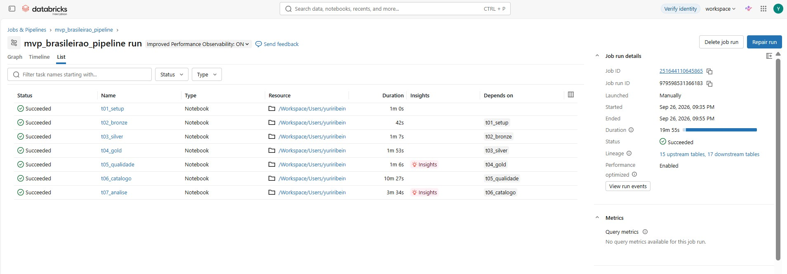
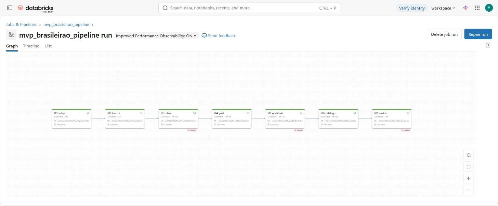
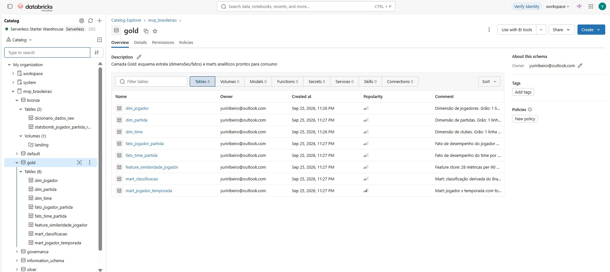

---

## 5. Qualidade de Dados (Etapa 4.5)

O notebook `05_qualidade_dados` roda 207 checagens nas cinco dimensões pedidas no enunciado e grava tudo em
`governanca.dq_resultados`, com histórico por execução. Se alguma checagem terminar com status ERRO (falha não
tratada), a execução para com `assert`. Nesta carga não houve nenhuma. O relatório completo está em
[`docs/qualidade_dados.md`](docs/qualidade_dados.md).

| Dimensão | OK | ALERTA (tratado) | Principais achados |
|---|---:|---:|---|
| Completude | 117 | 51 | 51 colunas com nulos na origem, todas cobertas pela regra do dicionário (preenchidas ou mantidas como NULL informativo) |
| Unicidade | 10 | 0 | Grão (match_id, player_id) único na Bronze e na Silver. PKs únicas em todas as tabelas Gold |
| Consistência | 6 | 3 | Nomes de clube fora do padrão, homônimos e cobertura 360 parcial |
| Acurácia | 9 | 3 | Placar derivado diferente do oficial (gols contra) e OBV negativo (que é válido) |
| Outliers | 3 | 5 | Per-90 explode com poucos minutos. O corte de 900 min resolve |

### 5.1 Problemas Encontrados e Tratamento

| # | Problema | Evidência | Tratamento |
|---|---|---|---|
| Q1 | Nulos com significados diferentes | 51 colunas com nulos. Ex.: `claim_success` 96% nulo (só goleiros), `np_xg_per_shot` 53% (só quem finalizou), `pressures` 7,8% | Regra por variável vinda do dicionário (T2). Nada foi preenchido no escuro |
| Q2 | Nomes de clubes fora do padrão | 4 de 20 clubes (`Sc Do Recife`, `EC Juventude`, `EC Vitória`, `Mirassol Futebol Clube`) | De-para versionado (T3) + regra `time_nao_mapeado` |
| Q3 | Homônimos | 40 nomes compartilhados por player_ids diferentes (ex.: 3 "Allan", de Botafogo, Flamengo e Palmeiras, e 4 "Gabriel") | `player_id` é a chave. `nome_exibicao` = nome + clube |
| Q4 | Transferências no meio da temporada | 25 jogadores com 2 clubes | Clube principal = clube com mais minutos. O fato mantém o clube de cada partida |
| Q5 | Placar derivado diferente do oficial | Soma dos gols dos jogadores = 937, contra 960 oficiais: 23 gols contra não são creditados pela StatsBomb. 16 clubes com gols pró divergentes e 11 com pontos divergentes (ex.: Fortaleza, 46 derivados x 43 oficiais) | Tabela de referência oficial carregada na Silver. O mart expõe `pontos_oficiais`, `posicao_oficial` e `gols_contra_a_favor_nao_creditados`, e a P2 usa os pontos oficiais |
| Q6 | Cobertura 360 parcial | 81 linhas jogador-partida sem cobertura. Métricas de espaço com até 75% de nulos | Flag `tem_cobertura_360` e métricas 360 fora da Gold |
| Q7 | Outliers de amostra pequena | xG/90: 12 outliers extremos (Q3 + 3xIQR) entre todos os jogadores de linha e 2 entre os com mais de 900 min. O máximo cai de 1,09 (menos de 300 min) para 0,61 | Flag `elegivel_analise` (linha, mínimo de 900 min) em todas as análises per-90 |
| Q8 | OBV negativo | 3.800 linhas com `obv < 0` | Não é erro. OBV mede a variação da probabilidade de gol e pode ser negativo. Mantido e documentado |

> **Princípio adotado:** dado errado é pior do que dado ausente. Por isso nenhum nulo foi preenchido sem uma
> regra explícita vinda do dicionário.

### 5.2 Checagens que Passaram

Também vale registrar o que foi verificado e estava correto:

- 0 duplicatas e 0 falhas de tipagem;
- minutos sempre em (0, 130] e todas as razões em [0, 1];
- `certos <= tentados` em passes, bolas longas, aéreos e cruzamentos;
- toda partida com exatamente 2 clubes e pelo menos 1 goleiro por lado;
- posse idêntica entre jogadores do mesmo time, somando 100% com o adversário;
- gols do time = gols sofridos registrados pelo goleiro adversário em 760 de 760 jogos;
- 38 jogos por clube;
- reconciliação Bronze = Silver + quarentena.

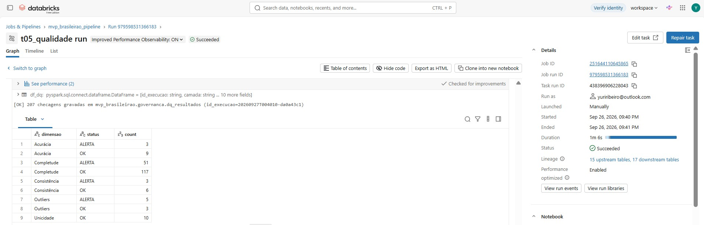

---

## 6. Análise de Dados (Etapa 4.5)

Todas as respostas são consultas **SQL sobre a Gold** no notebook `07_analise_perguntas` (as consultas estão lá, célula a célula).

### P1 - Botafogo × liga (por jogo)

| | xG pró | xG contra | Finalizações | Finalizações cedidas | Pressões | Recuperações | Posse | Passes certos |
|---|---:|---:|---:|---:|---:|---:|---:|---:|
| **Botafogo** | **1,20** | **0,97** | **14,3** | **11,9** | 169 | 80,6 | 51,7% | 83,7% |
| Média da liga | 1,09 | 1,09 | 12,9 | 12,9 | 168 | 81,9 | 50,0% | 81,5% |
| Melhor da liga | 1,39 | 0,74 | 15,3 | 9,4 | 186 | 89,2 | 61,4% | 87,0% |
| Ranking do Botafogo (1–20) | 5º | 7º | 4º | 5º | 10º | 14º | 9º | 5º |

**Discussão:** o Botafogo foi um time acima da média nos **dois lados da bola em termos de chances**: criou
10% mais xG por jogo que a média (5º da liga) e cedeu 11% menos (7º). É um perfil de time que controla o jogo
com a bola, com precisão de passe no top 5. Em **intensidade sem a bola** foi apenas mediano: 10º em pressões e
14º em recuperações. Para a comissão técnica, a leitura é que a superioridade veio mais da qualidade na posse do
que da recuperação alta. A distância para o melhor da liga está sobretudo na defesa (0,97 × 0,74 de xG cedido
por jogo).

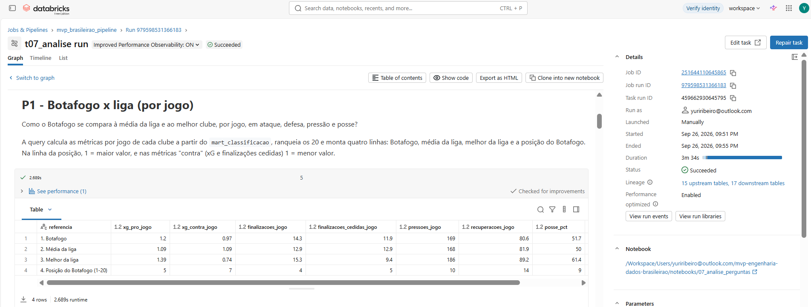

### P2 - xG explica os pontos?

| Correlação (20 clubes) | Valor |
|---|---:|
| saldo de xG × pontos oficiais | **0,932** (R² = 0,869) |
| saldo de gols × pontos oficiais | 0,969 |
| xG pró × gols pró | 0,876 |
| xG contra × gols contra | 0,923 |
| Pontos por +1 de saldo de xG na temporada | ≈ 1,16 |

| Clube | Pontos | Previstos pelo xG | Diferença | Leitura |
|---|---:|---:|---:|---|
| Grêmio | 49 | 41,6 | **+7,4** | Defesa sofreu 6,4 gols a menos que o xG cedido |
| Juventude | 35 | 27,7 | +7,3 | Mesmo rebaixado, fez mais pontos do que o volume indicava |
| Vasco | 45 | 39,3 | +5,7 | Ataque marcou 10,1 gols acima do xG (Rayan, Nuno Moreira) |
| Cruzeiro | 70 | 64,5 | +5,5 | |
| **Botafogo** | **63** | **62,0** | **+1,0** | Pontuação coerente com o desempenho: ataque +7,4 gols acima do xG, defesa −2,0 |
| Internacional | 44 | 50,3 | −6,3 | Sofreu 10,3 gols a mais que o xG cedido |
| Ceará | 43 | 49,5 | −6,5 | Rebaixado com saldo de xG de apenas −2,2 |
| Sport | 17 | 27,6 | −10,6 | |
| Corinthians | 47 | 56,7 | **−9,7** | Saldo de xG positivo (+4,1) e ataque 3,5 gols abaixo do esperado |

**Discussão:** o saldo de xG explica **~87% da variação de pontos** entre os clubes. É um indicador de processo
confiável para avaliar a comissão técnica independentemente da variância dos resultados. Os resíduos apontam onde
a sorte ou a eficiência pesou: o Corinthians teve desempenho de G-6 (saldo de xG +4,1) e terminou em 13º. O
Grêmio fez o caminho inverso. O Botafogo terminou praticamente sobre a reta (+1 ponto), ou seja, a campanha
reflete o desempenho real.

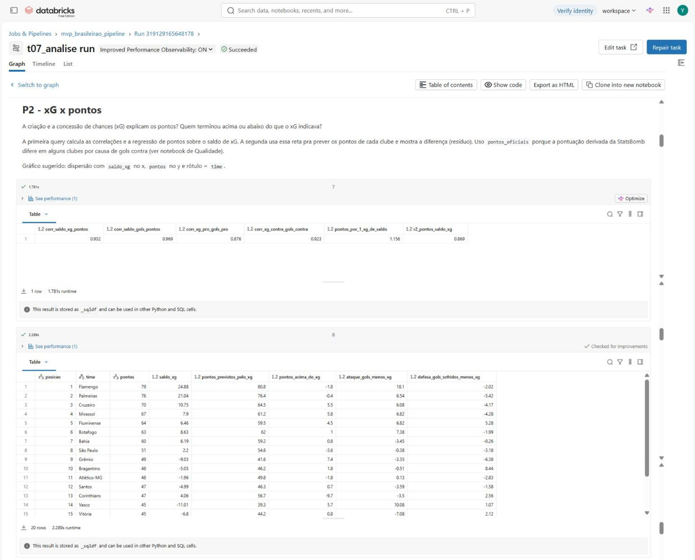

### P3 - líderes per-90 (linha, ≥ 900 min) e percentis do Botafogo

| # | npxG/90 | | xA/90 | | Passes decisivos/90 | |
|---|---|---:|---|---:|---|---:|
| 1 | Pedro (FLA) | 0,613 | Alan Patrick (INT) | 0,289 | Alan Patrick (INT) | 3,17 |
| 2 | Kaio Jorge (CRU) | 0,476 | De Arrascaeta (FLA) | 0,257 | Lucas Lima (SPT) | 2,91 |
| 3 | Vitor Roque (PAL) | 0,464 | Jhon Jhon (RBB) | 0,237 | Rodrigo Garro (COR) | 2,88 |
| 4 | Adam Bareiro (FOR) | 0,432 | Carlos Eduardo (MIR) | 0,233 | Jhon Jhon (RBB) | 2,65 |
| 5 | J. M. López (PAL) | 0,431 | Rodrigo Garro (COR) | 0,232 | Jhon Arias (FLU) | 2,56 |
| … | | | … | | | |
| 8 | | | **Santiago Rodríguez (BOT)** | **0,212** | | |

Percentil do Botafogo na liga (população elegível, 353 jogadores), seleção:

| Jogador | Min | npxG | xA | Progressões | Pressões | Recuperações | OBV |
|---|---:|---:|---:|---:|---:|---:|---:|
| Fernando Marçal | 1.134 | 64 | 22 | 75 | 16 | 91 | **97** |
| Alex Telles | 1.847 | 26 | 86 | 76 | 13 | 35 | **96** |
| Artur | 2.104 | 81 | 78 | 53 | 33 | 22 | 89 |
| Santiago Rodríguez | 1.477 | 64 | **98** | 68 | **97** | 29 | 81 |
| Jefferson Savarino | 2.101 | 82 | 95 | 59 | 48 | 11 | 51 |
| Marlon Freitas | 3.236 | 31 | 63 | **97** | 41 | 44 | 58 |
| Alexander Barboza | 2.377 | 56 | 7 | 65 | 22 | **99** | 49 |
| Igor Jesus | 982 | **93** | 71 | 13 | 77 | 6 | 1 |

**Discussão:** o Botafogo não teve nenhum jogador no top 10 de npxG/90. O volume ofensivo do time foi
distribuído, não concentrado em um centroavante. Santiago Rodríguez aparece no top 10 de xA/90 e combina
criação (percentil 98) com pressão (97), um perfil raro. Os laterais (Marçal, Alex Telles) estão entre os
maiores geradores de valor com bola (OBV) da liga. Os centroavantes (Igor Jesus, Arthur Cabral) ocupam bem as
posições de finalização (npxG ≥ percentil 90), mas pouco contribuem com a bola fora da área (OBV percentil ≤ 3).
Para o scouting, isso é um insumo objetivo para priorizar a posição de 9.

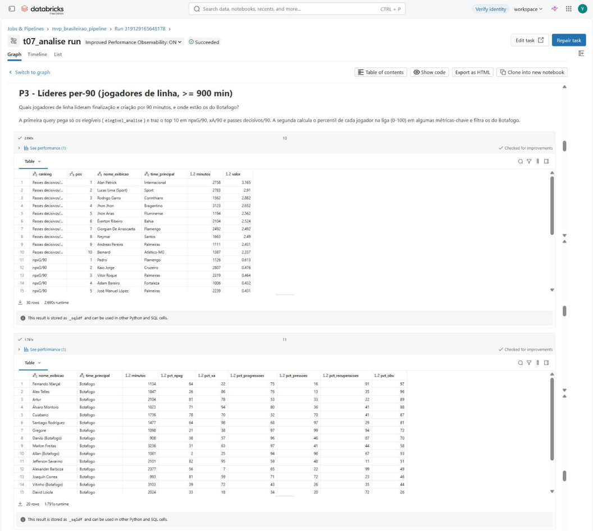

### P4 - finalização acima ou abaixo do esperado (≥ 30 finalizações sem pênalti)

| Acima do esperado | G | xG | G − xG | | Abaixo do esperado | G | xG | G − xG |
|---|---:|---:|---:|---|---|---:|---:|---:|
| De Arrascaeta (FLA) | 16 | 7,20 | **+8,80** | | Erick Pulga (BAH) | 3 | 6,24 | **−3,24** |
| Rayan (VAS) | 12 | 6,52 | +5,48 | | Rony (CAM) | 6 | 9,04 | −3,04 |
| Kaio Jorge (CRU) | 20 | 14,84 | +5,16 | | Borré (INT) | 4 | 6,58 | −2,58 |
| Reinaldo (MIR) | 7 | 2,63 | +4,37 | | Eduardo Sasha (RBB) | 5 | 7,38 | −2,38 |
| Luiz Araujo (FLA) | 7 | 3,09 | +3,91 | | Derik Lacerda (SPT) | 5 | 7,15 | −2,15 |

**Discussão:** De Arrascaeta marcou mais que o dobro do esperado (2,2 gols por xG) em finalizações de baixa
qualidade média (0,095 xG por chute), o que sugere habilidade real de finalização de média distância, algo que o
modelo de xG não captura. Kaio Jorge combina **alto volume de xG e sobre-performance**: é o perfil mais sólido
para mercado. Na outra ponta, Rony e Borré geraram boas chances (≈ 0,12–0,14 xG por chute) e as desperdiçaram.
Como a sobre-performance de finalização tende a regredir à média de uma temporada para outra, o scouting deve
priorizar **xG gerado** (P3) em vez de gols.

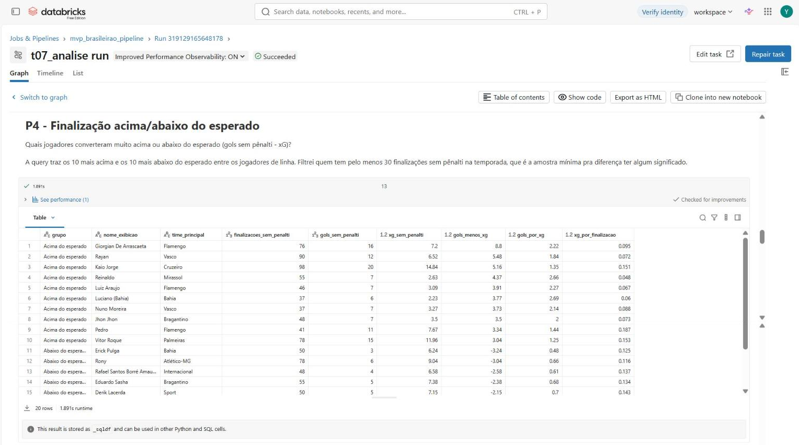

### P5 - concentração de minutos por elenco

| Clube | Jogadores utilizados | Jogadores para 80% dos minutos | % dos minutos no top 11 | Posição oficial |
|---|---:|---:|---:|---:|
| Cruzeiro | 37 | **12** | **77,3%** | 3º |
| Mirassol | 34 | 14 | 70,8% | 4º |
| Ceará | 33 | 14 | 70,3% | 17º |
| Palmeiras | 38 | 18 | 57,9% | 2º |
| Flamengo | 43 | 19 | 57,0% | 1º |
| **Botafogo** | **41** | **20** | **56,3%** | **6º** |
| Fortaleza | 44 | 21 | 52,7% | 18º |

**Discussão:** Cruzeiro e Mirassol fizeram campanhas fortes com **núcleos muito fixos** (12 a 14 jogadores
somam 80% dos minutos). Flamengo e Palmeiras, que disputaram também Libertadores e Copa do Brasil, **rodaram
bastante** (18 a 19 jogadores). O Botafogo foi um dos elencos que mais distribuiu minutos (20 atletas para 80%,
41 utilizados), em linha com a carga de competições paralelas (Mundial de Clubes e Libertadores). Isso reforça a importância de profundidade de
elenco no planejamento de contratações. Concentração sozinha não explica resultado: o Ceará também teve núcleo
fixo e foi rebaixado.

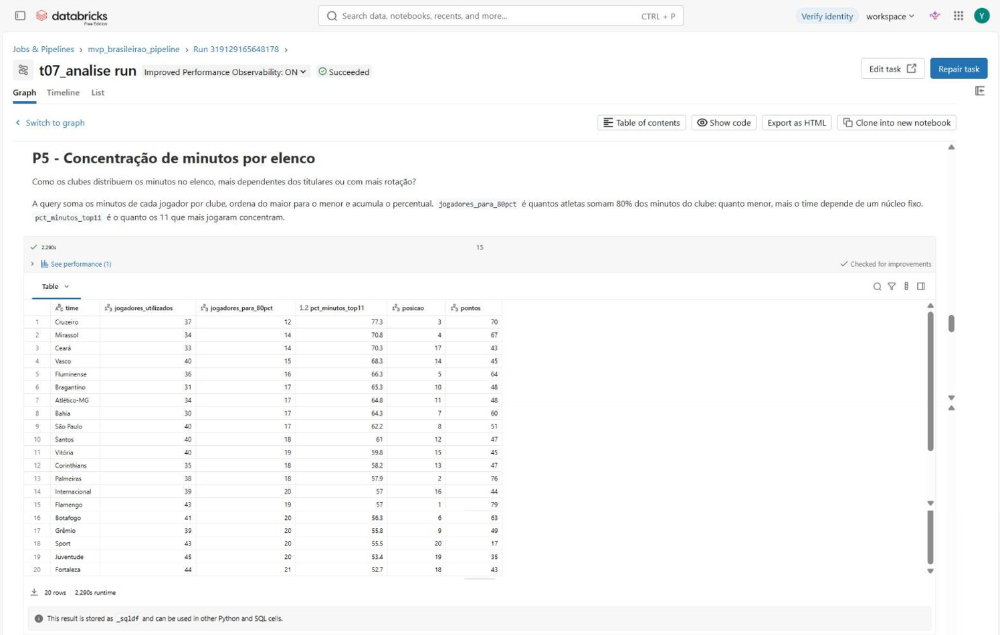

### P6 - jogadores mais parecidos com Alexander Barboza (cosseno, 28 features z-score)

| # | Jogador | Clube | Minutos | Similaridade |
|---|---|---|---:|---:|
| 1 | Murilo Cerqueira | Palmeiras | 1.830 | 0,880 |
| 2 | Cauan Lucas Barros da Luz | Vasco | 1.468 | 0,829 |
| 3 | Kaio Pantaleão | **Botafogo** | 1.031 | 0,818 |
| 4 | Alix Vinicius | Bragantino | 955 | 0,812 |
| 5 | João Victor | Vasco | 1.592 | 0,811 |
| 8 | Sabino | São Paulo | 2.592 | 0,803 |
| 9 | Gustavo Gómez | Palmeiras | 2.572 | 0,799 |

**Discussão:** a lista é dominada por **zagueiros** (Murilo, Pantaleão, Alix Vinicius, João Victor, Sabino,
Gustavo Gómez, Micael, Juninho). O modelo recupera a posição sem que ela exista na fonte, o que valida o vetor de features. O perfil de Barboza é de zagueiro de **jogo aéreo e cortes** (z = +2,1
e +1,8) com **boa saída longa** (z = +1,3). Murilo (PAL) é o mais próximo justamente por combinar aéreo e bola
longa. Kaio Pantaleão, do próprio elenco, aparece em 3º: é a **reposição interna natural** em caso de venda ou
lesão. A consulta roda **em SQL puro** sobre `gold.feature_similaridade_jogador` (`zip_with` + `aggregate`), sem
exportar dados para Python. A Gold serve diretamente o caso de uso do MVP de ML.

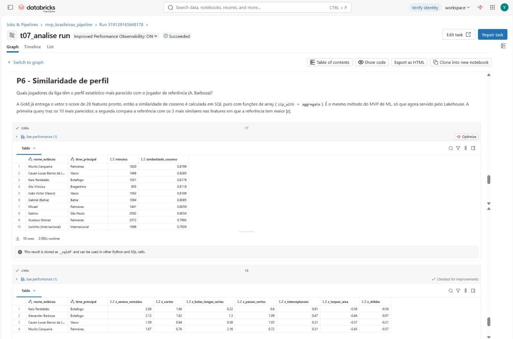

### Discussão Geral

O pipeline cumpriu o objetivo de transformar um export técnico de 167 colunas em uma base que responde, em
SQL, às perguntas das três áreas. A **P2** dá o fundamento das demais: se o saldo de xG explica ~87% dos pontos,
métricas de processo (xG, xA, OBV) são uma base legítima para avaliar clubes (P1) e jogadores (P3, P4, P6). O
Botafogo 2025 aparece como um time **de posse e criação acima da média**, com pontuação coerente com o
desempenho, elenco muito rodado (P5), carência de um 9 completo (P3) e reposição interna para a zaga (P6).
A qualidade de dados também gerou valor analítico: sem a reconciliação com a tabela oficial (Q5), 11 clubes
teriam pontuação errada em qualquer análise de resultado.

---

## 7. Autoavaliação

**Objetivos atingidos.** As seis perguntas foram respondidas integralmente com consultas SQL sobre a Gold. O
pipeline cobre todas as etapas do enunciado: coleta com metadados, modelagem em estrela com PK/FK, catálogo em
três formas (UC, tabela e Markdown) com domínio e linhagem, ETL documentado transformação a transformação, 207
checagens de qualidade persistidas e análise com discussão.

**O que funcionou bem.**
- Usar o **dicionário de dados do MVP anterior como motor do pipeline** (tipagem, missing e documentação da Silver) evitou regras duplicadas e deu rastreabilidade a cada decisão de tratamento.
- A checagem de reconciliação com a tabela oficial revelou um problema **invisível dentro da própria fonte**: os gols contra não creditados. Todas as checagens internas passavam (gols = gols sofridos pelo goleiro adversário), mas os pontos de 11 clubes estavam errados.
- Validei o pipeline também **fora do Databricks**, com PySpark 4 em modo ANSI (`tests/run_local.py`). O teste pegou uma divisão por zero (goleiros sem finalização) que também quebraria no serverless.

**Dificuldades.**
- A fonte **não tem placar, data, rodada, mando nem posição**. Placar e posição tiveram de ser derivados (soma de gols e flag de goleiro), e isso impediu análises temporais (evolução por rodada) e de mando.
- O Free Edition permite **uma única execução ativa por vez**. A primeira versão do orquestrador usava `dbutils.notebook.run`, e as execuções-filhas ficavam esperando para sempre a execução-pai terminar. Resolvi de duas formas: o orquestrador passou a usar `%run` (mesma sessão), e a execução oficial foi feita como **Job multi-tarefa** com dependências (01 → 07), em que cada tarefa roda em sequência.
- Outras diferenças do Free Edition/serverless: sem controle de cluster, confs Spark restritas (por isso usei variáveis de sessão SQL em vez de `${}`) e possível restrição a `CREATE CATALOG` (o pipeline aceita `catalogo=workspace`).
- Equilibrar a quantidade de métricas: 161 métricas brutas contra 49 no fato. Deixei a Silver completa e a Gold enxuta.

**Limitações conhecidas.**
- A classificação oficial é uma tabela de referência inserida manualmente; em produção deveria vir de uma API (ex.: StatsBomb Matches) com placar e data.
- O clube principal de jogadores transferidos simplifica a análise per-90 (os totais somam os dois clubes).
- O corte de 900 minutos é uma convenção de mercado, não otimizada estatisticamente.

**Trabalhos futuros.**
1. Ingerir o endpoint de **partidas** da StatsBomb (data, rodada, mando, placar oficial) → `dim_data` e análises por rodada ou turno, removendo a dependência da tabela de referência.
2. Tornar a carga **incremental** (Auto Loader + `MERGE`) para acompanhar a temporada 2026 rodada a rodada.
3. Migrar as regras de qualidade para **Lakeflow Declarative Pipelines** com *expectations*.
4. Publicar um **dashboard AI/BI** sobre os marts para a comissão técnica e servir a similaridade via **Vector Search** ou modelo registrado no MLflow.
5. Incorporar dados de **eventos com coordenadas (x, y)** e 360 para métricas espaciais (zonas de ação, mapas de calor).

---

## 8. Como Reproduzir

Passo a passo para rodar o projeto do zero:

1. Crie uma conta no [Databricks Free Edition](https://www.databricks.com/learn/free-edition).
2. Vá em **Workspace > Create > Git folder** e cole a URL deste repositório: `https://github.com/insanityz-15/mvp_pucrj_eng_de_dados`.
3. Abra `notebooks/01_setup_ambiente` e execute. Ele cria o catálogo, os schemas e o volume. Se a conta não permitir `CREATE CATALOG`, é só trocar o widget para `catalogo = workspace`.
4. Faça o upload dos dois CSVs para `/Volumes/mvp_brasileirao/bronze/landing/statsbomb/brasileirao_2025/`.
5. Execute o `notebooks/99_pipeline_orquestrador` ou, melhor ainda, crie o Job a partir do `jobs/job_pipeline_mvp.yml` (7 tarefas encadeadas). No YAML, troque `<seu_email>` pelo seu usuário do Databricks.
6. Os resultados ficam no `07_analise_perguntas`, na `governanca.dq_resultados` e na `governanca.catalogo_dados`.

**Teste local (opcional):** `pip install pyspark==4.0.1` e depois `python tests/run_local.py <pasta_com_os_csv>`.
Ele roda os mesmos notebooks com PySpark local, usando metastore Hive e parquet no lugar de Unity Catalog e Delta.

### 8.1 Estrutura do Repositório

```
├── README.md                     ← este documento (entrega do MVP)
├── notebooks/                    ← notebooks Databricks (formato source .py, importáveis via Git folder)
├── jobs/job_pipeline_mvp.yml     ← definição do Lakeflow Job
├── docs/
│   ├── catalogo_dados.md         ← catálogo completo (gerado a partir do UC)
│   ├── qualidade_dados.md        ← resultado das checagens de qualidade
│   └── evidencias/               ← prints da plataforma
└── tests/run_local.py            ← teste de fumaça local com PySpark
```
